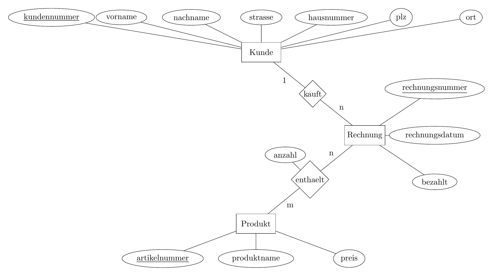

# Rechnungsdatenbank
## Kontext
### Inhalt und Grund

Diese Repo beinhaltet eine SQL Datei mit Dummy-Daten, die in eine MySQL datenbank einfach importiert werden können. Diese Repo soll meine Kenntnisse in SQL und MySQL demonstrieren. Außerdem werde ich diese Dummydatenbank in Zukunft für andere Projekte benutzten.

Die Datenbank beinhaltet Daten über Rechnungen mit zugehörigen Kunden und die jeweiligen Produkt die gekauft wurden.

### ER-Diagramm

Das Schema der Datenbank richtet sich nach folgendem Er-Diagramm:



## Import

Als Erstes muss eine neue Datenbank erstellt werden.
```
mysql> CREATE DATABASE Rechnungen;
```

Anschließend kann die Datenbank folgendermaßen importiert werden.
```
mysql -h 'hostname' -u 'username' -p Rechnungen < ./Rechnungen.sql
```

## Inhalt

Die Inhalte der Datenbank sind folgende:

### Kunde
```
mysql> select * from Kunde;
+--------------+-----------+-------------+------------------------+------------+-------+-------+
| kundennummer | vorname   | nachname    | strasse                | hausnummer | plz   | ort   |
+--------------+-----------+-------------+------------------------+------------+-------+-------+
|            1 | Andreas   | Metzger     | Krementzstr.           |          5 | 50931 | Köln  |
|            2 | Sandra    | Schmidt     | Ludwigsburger Str.     |         21 | 50739 | Köln  |
|            3 | Christian | Ebersbacher | Thorwaldsenstr.        |         12 | 51103 | Köln  |
|            4 | Brigitte  | Theiss      | Zehntstr.              |          6 | 51065 | Köln  |
|            5 | Daniela   | Beich       | Sigwinstr.             |        158 | 51061 | Köln  |
|            6 | Stefan    | Hahn        | Wilhelm-Schreiber-Str. |         46 | 50827 | Köln  |
+--------------+-----------+-------------+------------------------+------------+-------+-------+
```

### Produkt
```
mysql> select * from Produkt;
+---------------+----------------+-------+
| artikelnummer | produktname    | preis |
+---------------+----------------+-------+
|             1 | Mehl           |  2.39 |
|             2 | Milch          |  0.99 |
|             3 | Eier 10er      |  1.69 |
|             4 | Butter         |  2.15 |
|             5 | Zucker         |  1.39 |
|             6 | Salz           |   1.9 |
|             7 | Paprikapulver  |  1.99 |
|             8 | Pfeffer        |  2.49 |
|             9 | Sahne          |   1.2 |
|            10 | Tomaten        |  2.59 |
|            11 | Gurken         |  1.35 |
|            12 | Eisbergsalat   |  1.69 |
|            13 | Zwiebel        |  1.59 |
|            14 | Kartoffel      |   1.8 |
|            15 | Apfel          |  3.49 |
|            16 | Birnen         |  2.69 |
|            17 | Bananen        |  1.35 |
|            18 | Wasser         |  1.09 |
|            19 | Bleistift      |  0.79 |
|            20 | Radiergummi    |  1.03 |
|            21 | Kugelschreiber |  1.99 |
|            22 | Heft           |  0.26 |
+---------------+----------------+-------+

```

### Rechnung
```
mysql> select * from Rechnung;
+-----------------+--------------+----------------+-----------+
| rechnungsnummer | kundennummer | rechnungsdatum | bezahlt   |
+-----------------+--------------+----------------+-----------+
|               1 |            1 | 2023-10-01     | unbezahlt |
|               2 |            3 | 2023-10-03     | unbezahlt |
|               3 |            4 | 2023-10-03     | unbezahlt |
|               4 |            6 | 2023-10-05     | unbezahlt |
|               5 |            2 | 2023-10-10     | unbezahlt |
|               6 |            1 | 2023-10-13     | unbezahlt |
|               7 |            5 | 2023-10-13     | unbezahlt |
|               8 |            4 | 2023-10-20     | unbezahlt |
|               9 |            2 | 2023-10-25     | unbezahlt |
|              10 |            5 | 2023-10-27     | unbezahlt |
|              11 |            4 | 2023-10-30     | unbezahlt |
+-----------------+--------------+----------------+-----------+
```

### enthaelt
```
mysql> select * from enthaelt;
+-----------------+---------------+--------+
| rechnungsnummer | artikelnummer | anzahl |
+-----------------+---------------+--------+
|               1 |             1 |      2 |
|               1 |             2 |      4 |
|               1 |             3 |      1 |
|               1 |             4 |      3 |
|               1 |             5 |      1 |
|               1 |             6 |      1 |
|               1 |             7 |      1 |
|               1 |             8 |      1 |
|               1 |            18 |      2 |
|               2 |             1 |      1 |
|               2 |             4 |      4 |
|               2 |             5 |      3 |
|               2 |             6 |      2 |
|               3 |             6 |      1 |
|               3 |            10 |      1 |
|               3 |            11 |      2 |
|               3 |            12 |      1 |
|               3 |            13 |      1 |
|               3 |            14 |      1 |
|               3 |            17 |      5 |
|               3 |            18 |      3 |
|               4 |             1 |      3 |
|               4 |             2 |      4 |
|               4 |             3 |      2 |
|               4 |             4 |      3 |
|               4 |             5 |      2 |
|               4 |             6 |      1 |
|               4 |             9 |      2 |
|               4 |            15 |      3 |
|               5 |            10 |      3 |
|               5 |            11 |      4 |
|               5 |            12 |      6 |
|               5 |            13 |      7 |
|               5 |            18 |      5 |
|               6 |            19 |      4 |
|               6 |            20 |      2 |
|               6 |            21 |      2 |
|               6 |            22 |      3 |
|               7 |             3 |      2 |
|               7 |             4 |      4 |
|               8 |             1 |      3 |
|               8 |             2 |      2 |
|               8 |            14 |      2 |
|               9 |             1 |      4 |
|               9 |             2 |      4 |
|               9 |             3 |      2 |
|               9 |             4 |      3 |
|               9 |             5 |      1 |
|               9 |             6 |      1 |
|               9 |             7 |      1 |
|               9 |             8 |      1 |
|               9 |             9 |      3 |
|               9 |            10 |      2 |
|               9 |            11 |      4 |
|               9 |            12 |      2 |
|               9 |            13 |      2 |
|               9 |            14 |      3 |
|               9 |            15 |      3 |
|               9 |            16 |      1 |
|               9 |            17 |      2 |
|               9 |            18 |      6 |
|              10 |             1 |      5 |
|              10 |             6 |      6 |
|              10 |            10 |      7 |
|              10 |            13 |      8 |
|              10 |            19 |      1 |
|              10 |            21 |      2 |
|              11 |             3 |      5 |
|              11 |             8 |      3 |
|              11 |            11 |      2 |
|              11 |            13 |      1 |
|              11 |            15 |      4 |
+-----------------+---------------+--------+
```

## mögliche SQL querys

1. Liste der Artikelnamen der Rechnung mit der Rechnungsnummer 1:
```
mysql> select p.produktname from Produkt as p inner join enthaelt as e on p.artikelnummer=e.artikelnummer where e.rechnungsnummer=1;
+---------------+
| produktname   |
+---------------+
| Mehl          |
| Milch         |
| Eier 10er     |
| Butter        |
| Zucker        |
| Salz          |
| Paprikapulver |
| Pfeffer       |
| Wasser        |
+---------------+
```
2. Liste aller Kunden und mit ihren Gesamtausgaben:
```
mysql> select concat(k.nachname,', ',k.vorname) as 'Nachname, Vorname', round(sum(p.preis*e.anzahl),2) as Gesamtausgaben from Kunde as k inner join Rechnung as r inner join enthaelt as e inner join Produkt as p on k.kundennummer=r.kundennummer and e.rechnungsnummer = r.rechnungsnummer and e.artikelnummer = p.artikelnummer group by k.kundennummer;
+------------------------+----------------+
| Nachname, Vorname      | Gesamtausgaben |
+------------------------+----------------+
| Metzger, Andreas       |          36.81 |
| Schmidt, Sandra        |         119.55 |
| Ebersbacher, Christian |          18.96 |
| Theiss, Brigitte       |          69.21 |
| Beich, Daniela         |          70.95 |
| Hahn, Stefan           |          38.51 |
+------------------------+----------------+
```
3. Liste aller Rechnungen mit Kundenname, Rechnungsdatum und Gesamtpreis:
```
mysql> select r.rechnungsnummer, concat(k.nachname,', ',k.vorname) as 'Nachname, Vorname', r.rechnungsnummer, round(sum(p.preis * e.anzahl),2) as Gesamtpreis from Kunde as k inner join Rechnung as r inner join enthaelt as e inner join Produkt as p on k.kundennummer = r.kundennummer and r.rechnungsnummer = e.rechnungsnummer and e.artikelnummer = p.artikelnummer group by r.rechnungsnummer;
+-----------------+------------------------+-----------------+-------------+
| rechnungsnummer | Nachname, Vorname      | rechnungsnummer | Gesamtpreis |
+-----------------+------------------------+-----------------+-------------+
|               1 | Metzger, Andreas       |               1 |       26.83 |
|               2 | Ebersbacher, Christian |               2 |       18.96 |
|               3 | Theiss, Brigitte       |               3 |       22.29 |
|               4 | Hahn, Stefan           |               4 |       38.51 |
|               5 | Schmidt, Sandra        |               5 |       39.89 |
|               6 | Metzger, Andreas       |               6 |        9.98 |
|               7 | Beich, Daniela         |               7 |       11.98 |
|               8 | Theiss, Brigitte       |               8 |       12.75 |
|               9 | Schmidt, Sandra        |               9 |       79.66 |
|              10 | Beich, Daniela         |              10 |       58.97 |
|              11 | Theiss, Brigitte       |              11 |       34.17 |
+-----------------+------------------------+-----------------+-------------+
```
4. Liste aller Artikel mit Gesamteinnahmen absteigend sortiert:

```
mysql> select p.produktname, round(sum(p.preis*e.anzahl),2) as Gesamteinnahme from Produkt as p inner join enthaelt as e on p.artikelnummer = e.artikelnummer group by p.artikelnummer order by Gesamteinnahme DESC;
+----------------+----------------+
| produktname    | Gesamteinnahme |
+----------------+----------------+
| Mehl           |          43.02 |
| Butter         |          36.55 |
| Apfel          |          34.90 |
| Tomaten        |          33.67 |
| Zwiebel        |          30.21 |
| Salz           |          22.80 |
| Eier 10er      |          20.28 |
| Wasser         |          17.44 |
| Gurken         |          16.20 |
| Eisbergsalat   |          15.21 |
| Milch          |          13.86 |
| Pfeffer        |          12.45 |
| Kartoffel      |          10.80 |
| Zucker         |           9.73 |
| Bananen        |           9.45 |
| Kugelschreiber |           7.96 |
| Sahne          |           6.00 |
| Paprikapulver  |           3.98 |
| Bleistift      |           3.95 |
| Birnen         |           2.69 |
| Radiergummi    |           2.06 |
| Heft           |           0.78 |
+----------------+----------------+

```
5. Liste aller Artikel mit Verkaufsanzahl absteigend sortiert:

```
mysql> select p.produktname, sum(e.anzahl) as Gesamtverkaufsanzahl from Produkt as p inner join enthaelt as e on p.artikelnummer = e.artikelnummer group by p.artikelnummer order by Gesamtverkaufsanzahl ASC;
+----------------+----------------------+
| produktname    | Gesamtverkaufsanzahl |
+----------------+----------------------+
| Birnen         |                    1 |
| Paprikapulver  |                    2 |
| Radiergummi    |                    2 |
| Heft           |                    3 |
| Kugelschreiber |                    4 |
| Bleistift      |                    5 |
| Pfeffer        |                    5 |
| Sahne          |                    5 |
| Kartoffel      |                    6 |
| Zucker         |                    7 |
| Bananen        |                    7 |
| Eisbergsalat   |                    9 |
| Apfel          |                   10 |
| Gurken         |                   12 |
| Eier 10er      |                   12 |
| Salz           |                   12 |
| Tomaten        |                   13 |
| Milch          |                   14 |
| Wasser         |                   16 |
| Butter         |                   17 |
| Mehl           |                   18 |
| Zwiebel        |                   19 |
+----------------+----------------------+
```
